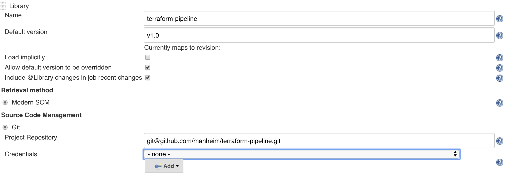
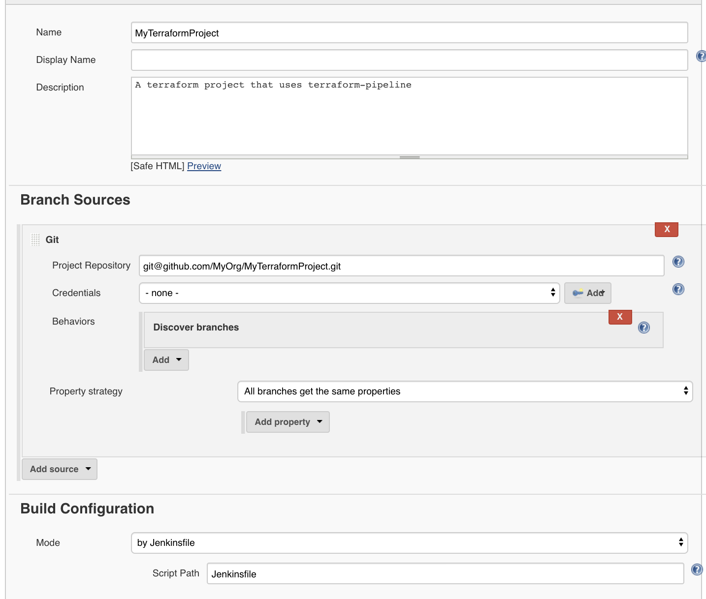
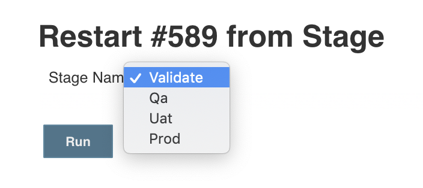

[](https://travis-ci.com/manheim/terraform-pipeline)

# terraform-pipeline
A reusable pipeline template to apply terraform configuration serially across multiple environments.

# Requirements and Assumptions
1.  You have a separate terraform project that can be run with the following commands:
    1.  `terraform init`
    2.  `terraform plan`
    3.  `terraform apply`
2.  After running a terraform plan, your pipeline will pause.  A human must review and confirm the plan before `terraform apply` is run.  See: [ConfirmApplyPlugin](#confirmapplyplugin).
3.  When running your pipeline on a branch, only the `terraform init` and `terraform plan` commands will be run across all of your environments.  `terraform apply` is only made available on the master branch. See: [ConditionalApplyPlugin](#conditionalapplyplugin).
4.  If your environments might create conflicting resources, a TF_VAR_environment variable is automatically available to your project and can be used to namespace your resources and avoid conflicts. See: [DefaultEnvironmentPlugin](#defaultenvironmentplugin).
5.  Import terraform-pipeline as a Jenkinsfile library to your Jenkins instance.


# How to Use
1.  Create a Jenkinsfile in your terraform project and import the [version](https://github.com/manheim/terraform-pipeline/releases) of terraform-pipeline that you want to use.  The example below uses `v5.1`, but it's recommended that you always use the latest version - unreleased changes are queued in the master branch, so using master may cause unexpected results.
```
// Jenkinsfile
@Library(['terraform-pipeline@v5.1']) _
```
2.  Provide terraform-pipeline with a reference to the Jenkinsfile context, so it can do all of it's magic under the hood.
```
// Jenkinsfile
...
Jenkinsfile.init(this)
```
3.  Start your pipeline with a syntatic analysis of your terraform project (this is optional, but highly recommended)
```
// Jenkinsfile
...
def validate = new TerraformValidateStage()
```
4.  Create deployment Stages for each of the environments that you would normally deploy to.  This example creates terraform resources for qa, uat, and prod environments.  The number and names of your environments can differ from this example.  Choose the environments and environment names that reflect your own development process to go from Code to Customer.
```
// Jenkinsfile
...
def deployQa = new TerraformEnvironmentStage('qa')
def deployUat = new TerraformEnvironmentStage('uat')
def deployProd = new TerraformEnvironmentStage('prod')
```
5.  Link the Stages together in the order that you want them to run.  This examples first does a syntactic validation, then deploys qa, then uat, then prod.  Each step *MUST* succeed before it can proceed on to the next.
```
// Jenkinsfile
...
validate.then(deployQa)
        .then(deployUat)
        .then(deployProd)
```
6.  The design of this library is influenced by the [Builder Pattern](https://en.wikipedia.org/wiki/Builder_pattern) - your pipeline has been configured, but hasn't been constructed just yet.  Finalize and create your pipeline by calling the `build()` method.  This should only be done once - no code should come after calling this method.
```
// Jenkinsfile
...
        .build()
```

7.  From beginning to end, your Jenkinsfile should roughly look like this:

```
@Library(['terraform-pipeline@v5.1']) _

Jenkinsfile.init(this)

def validate = new TerraformValidateStage()
def deployQa = new TerraformEnvironmentStage('qa')
def deployUat = new TerraformEnvironmentStage('uat')
def deployProd = new TerraformEnvironmentStage('prod')

validate.then(deployQa)
        .then(deployUat)
        .then(deployProd)
        .build()
```

8.  Load your project into Jenkins, and point it to your newly created Jenkinsfile.
    1. Create a new job using the 'New Item' menu

       
    2. Select Multibranch Pipeline after naming your new job

       
    3. Configure your new job, and point it to the location of your source code.

       

9.  If everything was successful, you should see something like this:


# Customizing Your Pipeline With Plugins

The example above gives you a bare-bones pipeline, and there may be Jenkinsfile features that you'd like to take advantage of.  Some of these features have been pre-defined as Plugins for this library.  Pre-defined plugins can be enabled by simply calling their static `init()` method.

### Default Plugins
* [ConfirmApplyPlugin](./docs/ConfirmApplyPlugin.md): pause and review the plan, before applying any changes.
* [ConditionalApplyPlugin](./docs/ConditionalApplyPlugin.md): only allow apply on master branch.
* [DefaultEnvironmentPlugin](./docs/DefaultEnvironmentPlugin.md): automatically set `TF_VAR_environment` variable.
* [TerraformPlugin](./docs/TerraformPlugin.md): apply version-specific terraform behavior based on the version of terraform in use.
### Credentials and Configuration Management
* [CredentialsPlugin](./docs/CredentialsPlugin.md): Inject Jenkins credentials into your stages.
* [FileParametersPlugin](./docs/FileParametersPlugin.md): Use properties files to inject environment-specific variables.
* [ParameterStoreBuildWrapperPlugin](./docs/ParameterStoreBuildWrapperPlugin.md): Inject environment-specific variables using `withAwsParameterStore`.
* [ParameterStoreExecPlugin](./docs/ParameterStoreExecPlugin.md): Inject environment-specific variables using parameter-store-exec.
* [TfvarsFilesPlugin](./docs/TfvarsFilesPlugin.md): Add environment specific tfvars files to your plan and apply commands.
### IAM Role Management
* [AwssumePlugin](./docs/AwssumePlugin.md): Use the awssume gem to assume different IAM roles.
* [WithAwsPlugin](./docs/WithAwsPlugin.md): Use `withAws` to assume different IAM roles.
### Terraform Backend Management
* [ConsulBackendPlugin](./docs/ConsulBackendPlugin.md): Use Consul backend to manage terraform state.
* [S3BackendPlugin](./docs/S3BackendPlugin.md): Use S3 backend to manage terraform state.
### Other
* [AgentNodePlugin](./docs/AgentNodePlugin.md): Run your pipeline on agents that are configured with Docker.
* [AnsiColorPlugin](./docs/AnsiColorPlugin.md): Enable ansi-color output.
* [CrqPlugin](./docs/CrqPlugin.md): Use the manheim_remedier gem to open automated Change Requests.
* [GithubPRPlanPlugin](./docs/GithubPRPlanPlugin.md): Use this to post Terraform plan results in the comments of a Github PullRequest.
* [TargetPlugin](./docs/TargetPlugin.md): set `-target` parameter for terraform plan and apply.
* [TerraformDirectoryPlugin](./docs/TerraformDirectoryPlugin.md): Change the default directory containing your terraform code.
* [TerraformLandscapePlugin](./docs/TerraformLandscapePlugin.md): Enable terraform-landscape plan output.

## Write your own Plugin

This library was intended to be customizable and extendable - if you don't find a predefined plugin for a feature that you need or want, feel free to create your own.

1.  Create your own shared library.  See: [DRY'ing your Plugin configuration](#drying-your-plugin-configuration)
2.  Create a `src` folder, and create a groovy file for your plugin.
3.  Define your class, and implement the appropriate Plugin interface, depending on which Stage or Command your plugin will affect. (Eg: [TerraformEnvironmentStagePlugin](./src/TerraformEnvironmentStagePlugin.groovy), [TerraformApplyCommandPlugin](./src/TerraformApplyCommandPlugin.groovy), etc).
4.  Define a `public static init()` method, then add an instance of your plugin to each of the Stages/Commands that it will modify.  (Eg: [AnsiColorPlugin](./src/AnsiColorPlugin.groovy#L6-L8))
5.  Import your shared library into your Jenkinsfile.
6.  Call your `init()` method in your Jenkinsfile before calling `build()` on your pipeline.
7.  If your plugin could be useful to others, feel free to put in a Pull Request.

## Plugin Order

Plugins often work by wrapping your stages in Jenkinfile DSL blocks.  If multiple plugins wrap your stages simultaneously, the order in which they are wrapped can be very important.  On the whole, terraform-pipeline strives to preserve and maintain the order you initialize the plugins, so that the corresponding Jenkinsfile DSL blocks execute predictably.

Take the following example:

* `ParameterStoreBuildWrapperPlugin` wraps your pipeline stages with the Jenkinsfile DSL `withAWSParameterStore { }` and can inject environment variables into your stage from ParameterStore key/value pairs.
* `WithAwsPlugin` wraps your pipeline stages with the Jenkinsfile DSL `withAws { }` and can execute your stage under the context of an IAM role that's defined by an environment variable.
* The two plugins can be used together - an IAM role can be defined in ParameterStore and translated to an environment variable `AWS_ROLE_ARN`, and that environment variable can in turn be used to configure the IAM role assumed by `WithAwsPlugin`.

Using terraform-pipeline, you might initialize your pipeline as such:

```
// Wrap everything before this in withAWS { }
WithAwsPlugin.init()

// Wrap everything before this in withAWSParameterStore { }
ParameterStoreBuildWrapperPlugin.init()
```

The above would generate roughly the following Jenkinsfile DSL:

```
...

    // Set a key value pair in ParameterStore so that AWS_ROLE_ARN=<SomeArn>
    withAWSParameterStore {
        ...
        // AWS_ROLE_ARN was set by ParameterStore
        // AWS_ROLE_ARN is picked up and used by withAWS
        withAWS(role: AWS_ROLE_ARN) {
            ...
        }
    }
...
```

The order in which the plugins were initialized determined the order of the Jenkinsfile DSL. Had the plugins been initialized in the reverse order, the Jenkinsfile DSL would likewise be reversed, and would lead to an undesirable outcome.

```
// Wrap everything before this in withAWSParameterStore { }
ParameterStoreBuildWrapperPlugin.init()

// Wrap everything before this in withAWS { }
WithAwsPlugin.init()
```

```
...

    // AWS_ROLE_ARN is not defined - withAWS does nothing
    withAWS(role: <?>) {
        ...
        // AWS_ROLE_ARN=<SomeArn> is defined in ParameterStore, but it's too late
        withAWSParameterStore {
            ...
        }
    }
...
```

# Control Where Your Jobs Are Run

By default, the pipeline jobs are not assigned to a particular Jenkins slave label.  If you want to tie your pipeline to particular Jenkins slave label, you can do so with the following line of code:

```
Jenkinsfile.defaultNodeName = 'myNode'
```

Alternatively, you can assign all of your pipelines to a particular Jenkins slave label without using code, by setting a `DEFAULT_NODE_NAME` environment variable on your Jenkins master.

# Additional Pipeline Stages

* [BuildStage](./docs/BuildStage.md) - build a deployment artifact that will subsequently be used by TerraformEnvironmentStage.
* [RegressionStage](./docs/RegressionStage.md) - run automated tests against an environment

# [DRY'ing](https://en.wikipedia.org/wiki/Don%27t_repeat_yourself) your Plugin configuration

It's likely that you'll use a number of different Plugins for your particular terraform-pipeline application.  It's also likely that you'll have a number of different applications using terraform-pipeline, and many of these applications may share the same plugin configuration.  Rather than duplicate and clutter your Jenkinsfile with these details, you can group all of your Plugin initialization into a single class, and share that class across your pipelines with a shared library.

1.  Create a new repository for the shared library called `terraform-pipeline-customizations`.
2.  In that repository, create a new file called `Customizations.groovy`.
3.  Create a static `init()` method in your class, and add your Plugin configuration there.  In the example below, the Customization will enable the AnsiColorPlugin, and the ParameterStoreBuildWrapperPlugin by default.
```
// Customizations.groovy

class Customizations {
    public static void init() {
        AnsiColorPlugin.init()
        ParameterStoreBuildWrapperPlugin.init()
    }
}
```
4. Load your repository as a shared library (See: [Using Libraries](https://jenkins.io/doc/book/pipeline/shared-libraries/)).
5. Import your shared library and pass your Customization class to the [Jenkinsfile.init()](./src/Jenkinsfile.groovy#L67-L74) method.  Like terraform-pipeline, it's a good practice to strictly control your customization library versions.
```
// Jenkinsfile
@Library(['terraform-pipeline@v5.1', 'terraform-pipeline-customizations@v1.0']) _

Jenkinsfile.init(this, Customizations)
...
```
6. Repeat Step 5 above for every project that you want to apply your Customzations to.

# Scripted vs Declarative Pipelines (+Restart From Stage)

Jenkinsfile has a number of quirks, which in turn creates a number of frustrating short-comings.  The most noticeable quirk is the two distinctive syntaxes for creating a pipeline:

1. [Scripted Pipelines](https://jenkins.io/doc/book/pipeline/syntax/#scripted-pipeline)
2. [Declarative Pipelines](https://jenkins.io/doc/book/pipeline/syntax/#declarative-pipeline)

Scripted Pipelines are much easier to work with, and offer a lot of flexibility and programmability.  Declarative Pipelines on the otherhand, are much less flexible, but offer the really important feature known as ['Restart From Stage'](https://jenkins.io/doc/book/pipeline/running-pipelines/#restart-from-a-stage) - the ability to re-run portions of a previous pipeline run.

terraform-pipeline attempts to abstract away these two different types of pipelines, so that you can get the features that you want, without needing to write your pipeline code in a specific/arbitrary way.

By default, your pipeline will be a Scripted Pipeline.  You can convert your pipeline to a Declarative Pipeline by enabling a flag:

```
Jenkinsfile.declarative = true
```

A short-coming of Declarative Pipelines is the inability to use variables when defining Stage names (See: [JENKINS-43820](https://issues.jenkins-ci.org/browse/JENKINS-43820)).  The compromise made by terraform-pipeline is to name each of the top-level Stage names using consecutive numbers '1', '2', '3', etc.  The following code:

```
@Library(['terraform-pipeline']) _

Jenkinsfile.init(this)
Jenkinsfile.declarative = true

def validate = new TerraformValidateStage()
def qa = new TerraformEnvironmentStage('qa')
def uat = new TerraformEnvironmentStage('uat')
def prod = new TerraformEnvironmentStage('prod')

validate.then(qa)
        .then(uat)
        .then(prod)
        .build()
```

will produce a Declarative Pipeline that looks like this:


When using the Restart from Stage feature, you'll need to map the numbered Stages to the Stages that you've defined in your Jenkinsfile.  In this example, 1 = Validate, 2 = Qa, 3 = Uat, 4 = Prod.


Mapping arbitrary numbers to your Stages can likely be annoying.  If you want to give your Stages more meaningful names, you can override the underlying Declarative Pipeline template with your own, using the `Jenkinsfile.pipelineTemplate` variable, and a Customizations library (See: [DRY'ing your Plugin Configuration](#drying-your-plugin-configuration)).

As an example, we'll create a `vars/CustomPipelineTemplate.groovy` in our customizations library, and define top-level Stages that match the Stages of our pipeline - `Validate`, `Qa`, `Uat`, and `Prod`.

```
// terraform-pipeline-customizations/vars/CustomPipelineTemplate.groovy

def call(args) {
    pipeline {
        agent none

        stages {
            stage('Validate') {
                steps {
                    script {
                        ((Stage)args.getAt(0)).build()
                    }
                }
            }

            stage('Qa') {
                steps {
                    script {
                        ((Stage)args.getAt(1)).build()
                    }
                }
            }

            stage('Uat') {
                steps {
                    script {
                        ((Stage)args.getAt(2)).build()
                    }
                }
            }

            stage('Prod') {
                steps {
                    script {
                        ((Stage)args.getAt(3)).build()
                    }
                }
            }
        }
    }
}
```

In your Jenkinsfile, override the default pipelineTemplate, and point it to your new pipeline template function.  For example:

```
@Library(['terraform-pipeline', 'terraform-pipeline-customizations']) _

Jenkinsfile.init(this)
Jenkinsfile.declarative = true
Jenkinsfile.pipelineTemplate = this.CustomPipelineTemplate

def validate = new TerraformValidateStage()
def qa = new TerraformEnvironmentStage('qa')
def uat = new TerraformEnvironmentStage('uat')
def prod = new TerraformEnvironmentStage('prod')

validate.then(qa)
        .then(uat)
        .then(prod)
        .build()
```

This will generate a new Declarative Pipeline, using your custom template.


Restart from Stage will now display more sensible names.  __Note:__ This is in __NO__ way dynamic.  If you reorder the Stages in your Jenkinsfile, you'll need to reorder the Stage names in your custom template.  This is an unfortunate side-effect of the strict syntax of Declarative Pipelines.



# Terraform Version Support
Some versions of terraform have made changes that affect a pipeline's workflow, eg: backend changes between v0.11 and v.12.  [TerraformPlugin](./docs/TerraformPlugin.md) provides a hooking point to addressing these, and future, differences.

By default, the plugin will detect a `.terraform-version` file in the root of your repo and adjust the terraform workflow accordingly.  Alternatively, you can declare your terraform version explicitly in code:

```
// Jenkinsfile

Jenkinsfile.init(this)
TerraformPlugin.withVersion('0.12.17')
```

If no `.terraform-version` file is found, and no explicit version is provided, the default version assigned by the library is `0.11.0`. This preserves all behavior prior to the introduction of this default plugin.

# How to Contribute

1.  Create an [Issue](https://github.com/manheim/terraform-pipeline/issues) for the change that's being made.
2.  All changes pending the next release will be staged in the master branch.
3.  Fork this project.
4.  Make a branch named after your issue, in your fork.
5.  Make your changes in the branch and run the tests and codestyle checks with with `./gradlew check --info`
6.  Update the CHANGELOG with your changes. Changes are queued under "Unreleased", until an official release is cut.
7.  Validate your changes by pointing a terraform-pipeline project to your fork's branch, and run an actual pipeline.
8.  Make a PR against the master branch of this project, and reference your Issue in the PR.
9.  Your PR will be reviewed and merged into master.
10.  Changes in master will be periodically grouped and published as a Release.

# Goals that this library is trying to achieve:

1.  Just like our application code, infrastructure code should be written once, and should be reusable for all environments.
    1.  Configuration, especially environment-specific configuration, should be externalized.  Where it's externalized to should be irrelevant.
2.  As much as possible, a pipeline should reflect what teams do to get from Code to Customer - no more, but also no less.
    1.  Allow teams to specify their own steps in that process, and teams should choose how those steps are linked together.
    2.  This is an OpenSource project - defaults should make reasonable sense for anyone that happens to use this project.
3.  Apply the [Open/Closed Principle](https://en.wikipedia.org/wiki/Open%E2%80%93closed_principle)
    1.  You should rarely need to change the base code, everything should be open for extension without modification to the base code.
    2.  It should be possible to add behaviors through Plugins and Decorations - this makes behavior addable/removable/extenable.
    3.  Think of plugins as interchangeable Lego pieces - you can swap one piece out for another, without fundamentally altering what it is to be a Pipeline.
4.  There should only be one way to Production, and that way should be crystal clear.
    1.  The master branch (or its equivalent) is the one-and-only way to Production.

